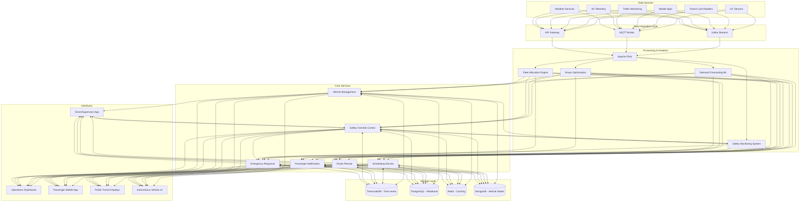

# Autonomous Vehicle Fleet Management System

## Overview
This system integrates self-driving buses into the city's existing transit infrastructure, optimizing resource allocation based on real-time demand, traffic conditions, and vehicle availability.

## Architecture Diagram

## Components Description

### Data Sources
- **IoT Sensors**: Passenger counting systems, bus stop occupancy sensors
- **Transit Card Readers**: Tap-in/tap-out data from fare collection
- **Mobile Apps**: Passenger booking, feedback, and location data
- **Traffic Monitoring**: Real-time traffic conditions, congestion, incidents
- **AV Telemetry**: Vehicle status, position, speed, fuel/battery levels
- **Weather Services**: Current and forecasted weather conditions

### Data Integration Layer
- **Kafka Streams**: High-throughput event streaming for sensor data
- **MQTT Broker**: Lightweight messaging protocol for vehicle communication
- **API Gateway**: Interface for external data sources and third-party services

### Processing & Analytics
- **Apache Flink**: Real-time stream processing for event correlation
- **Demand Forecasting ML**: Predictive models for passenger demand
- **Route Optimization**: Real-time route calculation based on traffic and demand
- **Fleet Allocation Engine**: Distribution of autonomous and conventional vehicles
- **Safety Monitoring System**: Real-time safety checks and anomaly detection

### Core Services
- **Vehicle Management**: Fleet status tracking and maintenance scheduling
- **Scheduling Service**: Dynamic schedule adaptation based on real-time conditions
- **Route Planner**: Optimal route calculation considering various constraints
- **Passenger Notification**: Real-time updates on bus arrivals, delays, and rerouting
- **Safety Override Control**: Remote intervention capability for autonomous vehicles
- **Emergency Response**: Automated protocols for incidents and emergencies

### Storage Layer
- **TimescaleDB**: Time-series database for sensor and telemetry data
- **PostgreSQL**: Relational database for routes, schedules, and passenger data
- **Redis**: In-memory caching for high-speed access to current vehicle states
- **MongoDB**: Document store for complex vehicle state snapshots and event logs

### Interfaces
- **Operations Dashboard**: Real-time monitoring for transit authorities
- **Driver/Supervisor App**: Mobile interface for human operators supervising AVs
- **Passenger Mobile App**: Trip planning, ticketing, and real-time updates
- **Public Transit Displays**: Digital signage at bus stops and transit hubs
- **Autonomous Vehicle UI**: On-board interfaces for passengers in autonomous vehicles

## Safety and Trade-offs

### Safety Mechanisms
1. **Multi-layered Monitoring**: Continuous vehicle telemetry analysis for anomalies
2. **Human-in-the-Loop**: Supervisor oversight for clusters of autonomous vehicles
3. **Geofenced Operations**: Initially limiting AV operation to well-mapped, lower-risk areas
4. **Fallback Modes**: Degradation protocols for sensor failures or connectivity issues
5. **Remote Override**: Capability for human operators to take control in emergencies

### Trade-offs and Resolutions

| Trade-off | Challenge | Architectural Resolution |
|-----------|-----------|--------------------------|
| Autonomy vs. Safety | More autonomy introduces safety risks | Phased implementation with increasing autonomy as safety data accumulates |
| Optimization vs. Predictability | Highly optimized routes may confuse passengers | Balance optimization with route consistency; communicate changes clearly |
| Cost vs. Coverage | Expensive to deploy AVs across entire network | Target high-demand routes for AV deployment; maintain conventional fleet for other areas |
| Centralized vs. Distributed Control | System outages in centralized architecture | Hybrid approach with edge computing for critical safety functions |
| Efficiency vs. Comfort | Most efficient routes may not be most comfortable | Passenger feedback loop to balance optimization algorithms |

## Implementation Phasing

1. **Pilot Phase**: Limited deployment on specific routes with full human backup
2. **Expanded Testing**: Increased AV coverage with reduced supervisor-to-vehicle ratio
3. **Mixed Fleet Operations**: Optimized allocation of AVs and conventional vehicles
4. **Full Integration**: Data-driven deployment across the network with dynamic allocation

This architecture enables a flexible, safe transition to an integrated autonomous and conventional transit system, with the ability to adjust vehicle allocation in near real-time based on changing conditions. 