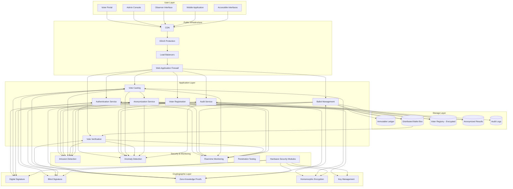

# E-Voting System Architecture

## Overview
This secure e-voting system architecture enables the transition from paper to online voting for national elections, handling millions of simultaneous users while ensuring anonymity, election transparency, security, and resilience against cyber-attacks.

## Architecture Diagram

## Components Description

### User Layer
- **Voter Portal**: Web-based interface for voter registration and casting votes
- **Admin Console**: Secure interface for election officials to manage the election
- **Observer Interface**: Transparent monitoring tools for authorized election observers
- **Mobile Application**: Accessible voting from smartphones with appropriate security
- **Accessible Interfaces**: Support for voters with disabilities (screen readers, etc.)

### Public Infrastructure
- **CDN**: Content delivery network for static assets to handle high load
- **DDoS Protection**: Mitigation of distributed denial-of-service attacks
- **Load Balancers**: Distribution of traffic across application servers
- **Web Application Firewall**: Protection against common web attacks

### Application Layer
- **Authentication Service**: Multi-factor voter identity verification
- **Voter Registration**: Management of eligible voter database
- **Ballot Management**: Creation and distribution of digital ballots
- **Vote Casting**: Secure interface for submitting votes
- **Vote Verification**: Allows voters to verify their vote was counted
- **Anonymization Service**: Separates voter identity from cast ballots
- **Audit Service**: Provides verifiable evidence of proper system operation

### Cryptographic Layer
- **Digital Signature**: Ensures integrity and authenticity of system operations
- **Blind Signature**: Allows authentication without revealing voter choices
- **Zero-Knowledge Proofs**: Verifies validity without revealing specific votes
- **Homomorphic Encryption**: Enables counting encrypted votes without decryption
- **Key Management**: Secure generation, storage, and rotation of cryptographic keys

### Storage Layer
- **Immutable Ledger**: Blockchain-based storage of election events and metadata
- **Distributed Ballot Box**: Encrypted storage of cast votes with redundancy
- **Voter Registry**: Securely encrypted database of eligible voters
- **Anonymized Results**: Aggregated vote totals without voter identity
- **Audit Logs**: Cryptographically signed records of all system activities

### Security & Monitoring
- **Intrusion Detection**: Real-time identification of unauthorized access attempts
- **Anomaly Detection**: AI-powered identification of unusual patterns
- **Real-time Monitoring**: Continuous observation of system health and security
- **Penetration Testing**: Ongoing security validation throughout the election
- **Hardware Security Modules**: Physical devices for secure key operations

## Design Choices and Trade-offs

| Design Choice | Trade-off | Mitigation Strategy |
|---------------|-----------|---------------------|
| Multi-factor Authentication | Increased security vs. Accessibility | Provide multiple authentication options and assistance centers |
| Blockchain Ledger | Transparency vs. Performance | Hybrid approach using optimized consensus for election use case |
| End-to-end Encryption | Security vs. Simplicity | User-friendly interfaces with clear verification steps |
| Distributed Architecture | Resilience vs. Complexity | Rigorous testing and failover mechanisms |
| Digital Identity | Convenience vs. Privacy | Separation of identity verification from vote storage |
| Homomorphic Encryption | Mathematical Verifiability vs. Processing Power | Optimized implementation for specific election counting needs |
| Open Source Components | Transparency vs. Security through Obscurity | Professional security audits and bug bounty programs |

## Security Measures

1. **Defense in Depth**: Multiple security layers with no single point of failure
2. **Segregation of Duties**: No single entity can access both voter identities and cast votes
3. **Air-Gapped Components**: Critical systems physically isolated from networks
4. **Code Attestation**: Verification that deployed code matches publicly audited versions
5. **Independent Verification**: Multiple independent methods to verify election integrity
6. **Post-Election Audit**: Statistical and cryptographic validation of results
7. **Physical Security**: Secure facilities for critical infrastructure components

## Scalability and Resilience

1. **Horizontal Scaling**: Ability to add capacity to handle millions of simultaneous users
2. **Geographic Distribution**: Multiple data centers across different regions
3. **Graceful Degradation**: Core voting functions preserved even under severe load or attack
4. **Redundant Infrastructure**: No single points of failure in critical paths
5. **Offline Capability**: Ability to continue operation during connectivity issues

## Transparency Mechanisms

1. **Verifiable Receipts**: Voters can verify their vote was counted correctly
2. **Public Bulletin Board**: Cryptographically secured public record of all anonymous votes
3. **Open Source Code**: Publicly auditable implementation
4. **Independent Observers**: Technical access for authorized election observers
5. **Public Audit**: Post-election verification procedures open to scrutiny

This architecture balances the critical requirements of security, anonymity, verifiability, and scalability required for a national e-voting system, with specific attention to transparency and resilience against cyber attacks. 