# Global Internship Marketplace Architecture

## Overview
This system connects international students with internship opportunities worldwide, streamlining application processes, document verification, and compliance with international labor regulations.

## Architecture Diagram

```mermaid
flowchart TD
    subgraph "User Interfaces"
        A1[Student Portal]
        A2[Company Dashboard]
        A3[University Admin Panel]
        A4[Regulatory Compliance Console]
        A5[Mobile Applications]
    end

    subgraph "API Gateway Layer"
        B1[REST API Gateway]
        B2[GraphQL API]
        B3[Authentication Service]
    end

    subgraph "Core Services"
        C1[Profile Management]
        C2[Opportunity Matching]
        C3[Application Processing]
        C4[Document Verification]
        C5[Regulatory Compliance]
        C6[Visa & Immigration]
        C7[Communication Hub]
        C8[Analytics Engine]
    end

    subgraph "Data Processing"
        D1[ML Matching Algorithm]
        D2[Document OCR]
        D3[Translation Service]
        D4[Regulatory Rules Engine]
        D5[Fraud Detection]
    end

    subgraph "Storage Layer"
        E1[(PostgreSQL - Relational)]
        E2[(MongoDB - Documents)]
        E3[(Elasticsearch - Search)]
        E4[(Redis - Caching)]
        E5[(S3 - Document Storage)]
    end

    subgraph "External Integrations"
        F1[University APIs]
        F2[Embassy/Consulate Services]
        F3[Background Check Services]
        F4[Payment Gateways]
        F5[Labor Departments]
    end

    A1 & A2 & A3 & A4 & A5 --> B1 & B2
    B1 & B2 --> B3
    B3 --> C1 & C2 & C3 & C4 & C5 & C6 & C7 & C8
    
    C2 --> D1
    C4 --> D2
    C4 & C5 & C7 --> D3
    C5 --> D4
    C4 & C5 --> D5
    
    C1 & C2 & C3 & C4 & C5 & C6 & C7 & C8 <--> E1 & E2 & E3 & E4 & E5
    
    C1 <--> F1
    C6 <--> F2
    C4 <--> F3
    C3 <--> F4
    C5 <--> F5
```

## Components Description

### User Interfaces
- **Student Portal**: Personalized dashboard for profile management, opportunity search, applications
- **Company Dashboard**: Posting opportunities, reviewing applications, managing internships
- **University Admin Panel**: Verifying student status, managing program affiliations
- **Regulatory Compliance Console**: Monitoring and reporting compliance metrics
- **Mobile Applications**: Native apps for students and companies with core functionality

### API Gateway Layer
- **REST API Gateway**: Traditional endpoints for service communication
- **GraphQL API**: Flexible queries for complex frontend requirements
- **Authentication Service**: Multi-factor authentication, SSO, and role-based access control

### Core Services
- **Profile Management**: Student and company profiles with verification status
- **Opportunity Matching**: Algorithm-based matching of students to opportunities
- **Application Processing**: Workflow management for multi-stage applications
- **Document Verification**: Validation of academic, identity, and legal documents
- **Regulatory Compliance**: Country-specific rule enforcement and compliance tracking
- **Visa & Immigration**: Assistance with visa applications and immigration requirements
- **Communication Hub**: Secure messaging, notifications, and translation services
- **Analytics Engine**: Reporting and insights for all stakeholders

### Data Processing
- **ML Matching Algorithm**: AI-powered matching based on skills, interests, and requirements
- **Document OCR**: Optical character recognition for document processing
- **Translation Service**: Real-time translation for cross-language communication
- **Regulatory Rules Engine**: Dynamic rule application based on jurisdiction
- **Fraud Detection**: AI-based system to identify fraudulent documents or applications

### Storage Layer
- **PostgreSQL**: Relational database for structured data (users, opportunities, applications)
- **MongoDB**: Document storage for semi-structured data (profiles, preferences)
- **Elasticsearch**: Search engine for opportunity discovery and complex queries
- **Redis**: Caching layer for performance optimization
- **S3**: Secure document storage for academic records, passports, and legal forms

### External Integrations
- **University APIs**: Verification of enrollment and academic credentials
- **Embassy/Consulate Services**: Integration with visa processing systems
- **Background Check Services**: Third-party verification of criminal records
- **Payment Gateways**: Processing of application fees and stipend payments
- **Labor Departments**: Automated reporting to relevant regulatory bodies

## Key Features and Capabilities

### For Students
1. **Global Discovery**: Search and filter internships worldwide by industry, duration, compensation
2. **Document Management**: Secure upload, storage, and sharing of verified documents
3. **Application Tracking**: Real-time status updates on all applications
4. **Visa Guidance**: Step-by-step assistance with visa requirements
5. **Compliance Support**: Clear guidance on local labor laws and regulations

### For Companies
1. **Talent Pipeline**: Access to a global pool of pre-verified students
2. **Regulatory Automation**: Simplified compliance with local and international regulations
3. **Document Verification**: Automated validation of student credentials
4. **Application Management**: Streamlined review and selection process
5. **Post-Placement Support**: Onboarding assistance and regulatory reporting

### For Universities
1. **Program Integration**: Connect university internship programs to global opportunities
2. **Student Verification**: Provide official enrollment and academic standing verification
3. **Outcome Tracking**: Monitor placement rates and student experiences
4. **Compliance Oversight**: Ensure partners meet university and regulatory standards

## Security and Privacy Considerations

1. **Data Sovereignty**: Region-specific data storage to comply with local laws (GDPR, CCPA)
2. **Document Security**: End-to-end encryption for sensitive documents
3. **Consent Management**: Granular permissions for data sharing between parties
4. **Audit Trails**: Comprehensive logging of all verification and compliance activities
5. **Privacy by Design**: Data minimization and purpose limitation principles

This architecture creates a trusted global ecosystem for internship matching that handles the complex challenges of international placement while ensuring regulatory compliance and streamlining the application process for all stakeholders. 