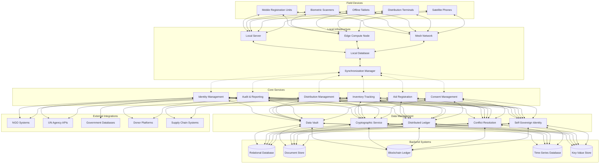

# Humanitarian Aid Distribution System

## Overview
This decentralized system enables fair and transparent aid distribution during humanitarian crises, using biometrics and digital IDs to register recipients, track aid deliveries, and ensure equitable access, even in remote or offline regions.

## Architecture Diagram

## Components Description

### Field Devices
- **Mobile Registration Units**: Ruggedized, battery-powered devices for field registration
- **Biometric Scanners**: Fingerprint, iris, or facial recognition devices with liveness detection
- **Offline Tablets**: Mobile devices with local data storage for disconnected operation
- **Distribution Terminals**: Points of service for aid distribution with verification
- **Satellite Phones**: Emergency communication when traditional networks are unavailable

### Local Infrastructure
- **Local Server**: Hardened, low-power servers deployed at distribution centers
- **Edge Compute Node**: Processing capabilities for verifying identity and transactions locally
- **Mesh Network**: Self-forming network using technologies like LoRa or WiFi mesh
- **Local Database**: Encrypted, replicated data store with conflict resolution
- **Synchronization Manager**: Manages data reconciliation during intermittent connectivity

### Core Services
- **Identity Management**: Creation and verification of secure digital identities
- **Aid Registration**: Registration of individuals and households for specific aid programs
- **Inventory Tracking**: Management of aid supplies from receipt to distribution
- **Distribution Management**: Scheduling and recording of aid disbursement
- **Audit & Reporting**: Transparent tracking of all distribution activities
- **Consent Management**: Recipient control over personal data sharing

### Data Management
- **Data Vault**: Secure storage for personal and biometric information
- **Cryptographic Service**: Encryption, digital signatures, and key management
- **Distributed Ledger**: Immutable record of aid transactions and distribution
- **Conflict Resolution**: Algorithms to resolve data conflicts during synchronization
- **Self-Sovereign Identity**: Framework allowing recipients to own and control their identity

### Backend Systems
- **Relational Database**: Structured data for operational records
- **Document Store**: Flexible storage for diverse document types and forms
- **Blockchain Ledger**: Immutable audit trail of distribution and consent
- **Time-Series Database**: Historical tracking of aid distribution and patterns
- **Key-Value Store**: High-performance cache for frequently accessed data

### External Integrations
- **NGO Systems**: Interfaces with partner organization systems
- **UN Agency APIs**: Standards-based integration with UN humanitarian platforms
- **Government Databases**: Secure verification against official records where available
- **Donor Platforms**: Transparent reporting to funding organizations
- **Supply Chain Systems**: Integration with logistics and inventory systems

## Data Ownership and Privacy

1. **Self-Sovereign Identity Principles**:
   - Recipients own their identity and personal data
   - Consent-based data sharing with revocation capabilities
   - Minimal disclosure (share only what's necessary)
   - Portable identity across different aid programs

2. **Data Protection Measures**:
   - End-to-end encryption of all personal data
   - Biometric templates stored as non-reversible hashes
   - Secure element storage on field devices
   - Zero-knowledge proofs for verification without data sharing

3. **Consent Framework**:
   - Granular permissions for specific data attributes
   - Time-bound authorizations that expire automatically
   - Audit trail of all data access and sharing
   - Offline consent capture with cryptographic signatures

## Offline-First Design

1. **Local Operation Capability**:
   - Complete functionality without internet connectivity
   - Local verification of identity and eligibility
   - Secure transaction recording for later synchronization
   - Conflict resolution for reconciling distributed updates

2. **Synchronization Mechanisms**:
   - Opportunistic data synchronization when connectivity is available
   - Prioritized sync for critical data elements
   - Bandwidth-aware transmission protocols
   - Partial/incremental synchronization for constrained networks
   - Multi-path synchronization (satellite, mobile, mesh networks)

3. **Resilience Features**:
   - Graceful degradation with reduced but functional capabilities
   - Data corruption detection and self-healing
   - Redundant storage with cryptographic verification
   - Battery backup and low-power operation modes

## Trust Architecture

1. **Decentralized Trust Model**:
   - No single controlling authority for all data
   - Consortium validation of transactions by multiple aid organizations
   - Cryptographic proof of data integrity and origin
   - Transparent and auditable decision processes

2. **Verification Methods**:
   - Multi-factor authentication combining biometrics and knowledge factors
   - Cross-verification across multiple agencies when possible
   - Progressive trust building with transaction history
   - Community attestation mechanisms for cases without formal ID

3. **Fraud Prevention**:
   - Duplicate detection across distributed systems
   - Anomaly detection for unusual patterns
   - Geographic and temporal plausibility checks
   - Real-time monitoring and alerting for suspicious activities

## Implementation Considerations

1. **Deployment Approach**:
   - Modular design for adaptation to different crisis scenarios
   - Rapidly deployable kits with pre-configured infrastructure
   - Training materials in multiple languages with visual guides
   - Regular simulation exercises for field readiness

2. **Hardware Requirements**:
   - Low power consumption for solar/battery operation
   - Environmental hardening (dust, water, temperature extremes)
   - Local repair capability with standard components
   - Physical security features for hardware

3. **Cultural Sensitivity**:
   - Configurable workflows respecting local customs
   - Multiple biometric options for cultural/religious considerations
   - Interface localization including non-written communication
   - Accommodation for varying literacy and technology familiarity

This architecture empowers aid recipients by giving them ownership of their digital identity while enabling efficient, transparent, and fair distribution of humanitarian assistance even in the most challenging environments. 