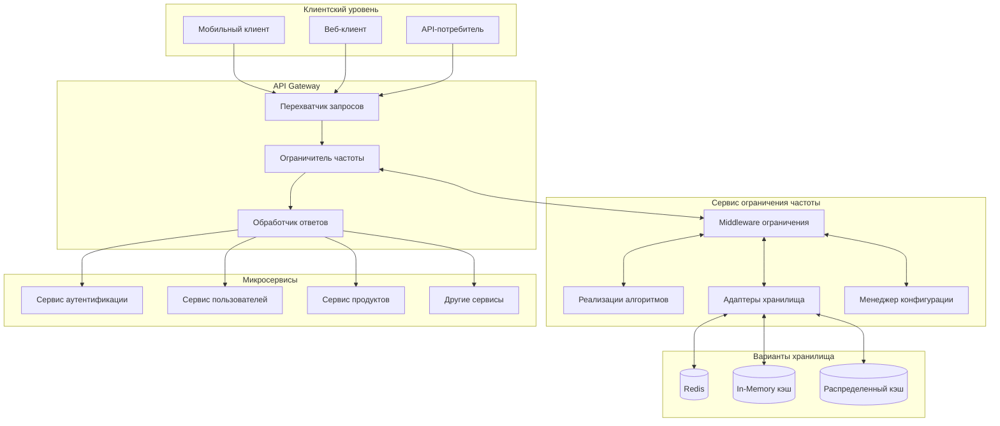
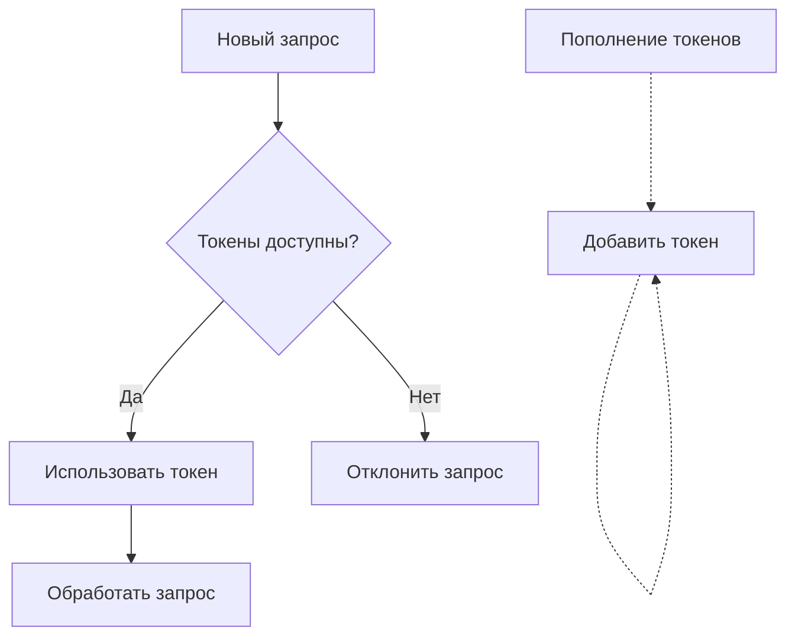

# API Rate Limiting Service (Python)

Надежная система ограничения частоты запросов для защиты ваших микросервисов от скачков трафика и обеспечения стабильной производительности.

## Обзор

Эта служба ограничения частоты запросов обеспечивает настраиваемое ограничение запросов для:
- Предотвращения злоупотребления API и DoS-атак
- Обеспечения справедливого распределения ресурсов между клиентами
- Поддержания стабильности сервиса при скачках трафика
- Защиты нижестоящих сервисов и баз данных

## Архитектура



## Реализованные алгоритмы

### 1. Алгоритм Token Bucket (Корзина токенов)

Основной используемый алгоритм - Token Bucket, который обеспечивает баланс между простотой и эффективностью:

- У каждого клиента есть корзина, которая заполняется токенами с постоянной скоростью
- Каждый запрос потребляет один токен из корзины
- Когда корзина пуста, дополнительные запросы отклоняются
- Допускает всплески трафика при сохранении долгосрочного лимита скорости



### 2. Алгоритм Sliding Window (Скользящее окно)

Для более точного контроля и предотвращения всплесков на границе окна:

- Отслеживает запросы в небольших временных окнах (например, 1-секундные интервалы)
- Рассчитывает взвешенную сумму текущего и предыдущего окна
- Обеспечивает более плавное дросселирование на границах окна
- Требует больше памяти, но обеспечивает лучшую защиту

### 3. Распределенное ограничение частоты

Для мультиэкземплярных развертываний:

- Использует Redis как централизованное хранилище счетчиков
- Атомарные операции инкремента и истечения срока действия
- Lua-скрипты для надежного применения ограничений
- Поддержка кластера для высокой доступности

## Параметры конфигурации

```python
{
    "default_limits": {
        "anonymous": {
            "rate": 30,
            "interval": "minute"
        },
        "authenticated": {
            "rate": 100,
            "interval": "minute"
        },
        "premium": {
            "rate": 600, 
            "interval": "minute"
        }
    },
    "endpoint_overrides": {
        "/api/sensitive-endpoint": {
            "rate": 10,
            "interval": "minute"
        },
        "/api/high-load": {
            "rate": 5,
            "interval": "minute"
        }
    },
    "ip_limits": {
        "enabled": True,
        "rate": 300,
        "interval": "hour"
    },
    "response_headers": {
        "enabled": True,
        "include_remaining": True
    },
    "storage": {
        "type": "redis",
        "options": {
            "host": "localhost",
            "port": 6379,
            "key_prefix": "ratelimit:"
        }
    }
}
```

## Обработка ответов

При превышении ограничений частоты запросов сервис:

1. Возвращает HTTP 429 (Too Many Requests)
2. Включает полезные заголовки:
   - `X-RateLimit-Limit`: Максимально допустимое количество запросов в периоде
   - `X-RateLimit-Remaining`: Оставшееся количество запросов в периоде
   - `X-RateLimit-Reset`: Секунды до сброса лимита
3. Предоставляет описательный JSON-ответ об ошибке
4. Опционально включает информацию о повторной попытке

Пример ответа:
```json
{
  "error": "Rate limit exceeded",
  "message": "Вы превысили лимит запросов: 100 запросов в минуту",
  "retry_after": 23
}
```

## Методы интеграции

### Flask Middleware

```python
from rate_limiter import RateLimiter

# Глобальное ограничение частоты запросов
limiter = RateLimiter()
app = Flask(__name__)
app.before_request(limiter.limit())

# Ограничение для конкретных маршрутов
@app.route('/api/sensitive')
@limiter.limit(rate=5, interval='minute')
def sensitive_endpoint():
    return jsonify({"data": "sensitive data"})
```

### FastAPI Middleware

```python
from fastapi import FastAPI, Request, Response, Depends
from rate_limiter.fastapi import RateLimiterMiddleware, rate_limit

app = FastAPI()
app.add_middleware(RateLimiterMiddleware)

# Ограничение для конкретного маршрута
@app.get("/api/sensitive")
@rate_limit(rate=5, interval="minute")
async def sensitive_endpoint():
    return {"data": "sensitive data"}
```

### Реализация сервиса

```python
from rate_limiter import RateLimiter

class UserService:
    def __init__(self):
        self.rate_limiter = RateLimiter(
            client_identifier='user_id',
            fallback_identifier='ip',
            key_prefix='user_service:',
            default_rate=100,
            default_interval='minute'
        )
    
    async def get_user(self, user_id, client_info):
        # Проверка ограничения перед обработкой
        limit_result = await self.rate_limiter.check(client_info)
        if not limit_result.allowed:
            raise RateLimitExceededError(limit_result)
        
        # Обработка запроса
        return await self.user_repository.find_by_id(user_id)
```

## Особенности производительности

- **In-memory хранилище**: Наиболее быстрое для однозадачных развертываний
- **Redis хранилище**: Рекомендуется для распределенных сред
- **Sliding window**: Более требовательно к CPU/памяти, чем token bucket
- **Cache optimization**: Настраиваемый TTL для предотвращения роста потребления памяти
- **Bulk operations**: Пакетные операции Redis для повышения производительности

## Мониторинг и метрики

Сервис предоставляет метрики, совместимые с Prometheus:

- `rate_limit_requests_total`: Счетчик общего количества обработанных запросов
- `rate_limit_throttled_total`: Счетчик лимитированных запросов
- `rate_limit_check_duration_seconds`: Гистограмма длительности проверки ограничений
- `rate_limit_remaining_gauge`: Датчик оставшейся емкости по типу ограничения

## Особенности масштабирования

- Горизонтальная масштабируемость с Redis в качестве центрального хранилища
- Опциональная поддержка кластера Redis для высокой доступности
- Настраиваемое истечение срока действия ключей для управления использованием памяти
- Lua-скрипты для атомарных операций в распределенных средах

## Лучшие практики

1. **Начните консервативно**: Начинайте с более высоких лимитов и корректируйте их вниз
2. **Дифференцированные лимиты**: Используйте разные лимиты для разных типов клиентов
3. **Четкая коммуникация**: Предоставляйте понятные заголовки и сообщения об ошибках
4. **Мягкая деградация**: Предусмотрите резервное поведение при недоступности Redis
5. **Мониторинг и корректировка**: Регулярно анализируйте шаблоны ограничений и настраивайте лимиты

## Установка и настройка

```bash
pip install rate-limiter-service
# или
git clone https://github.com/yourusername/rate-limiting-service-python.git
cd rate-limiting-service-python
pip install -e .
```

## Пример использования

```python
# config.json
{
  "default_limits": {
    "anonymous": {"rate": 30, "interval": "minute"}
  }
}

# app.py
from rate_limiter import create_limiter
from flask import Flask

app = Flask(__name__)
limiter = create_limiter(config_path='config.json')
app.before_request(limiter.limit())

@app.route('/')
def index():
    return 'Hello, World!'

if __name__ == '__main__':
    app.run()
```

## Лицензия

MIT 