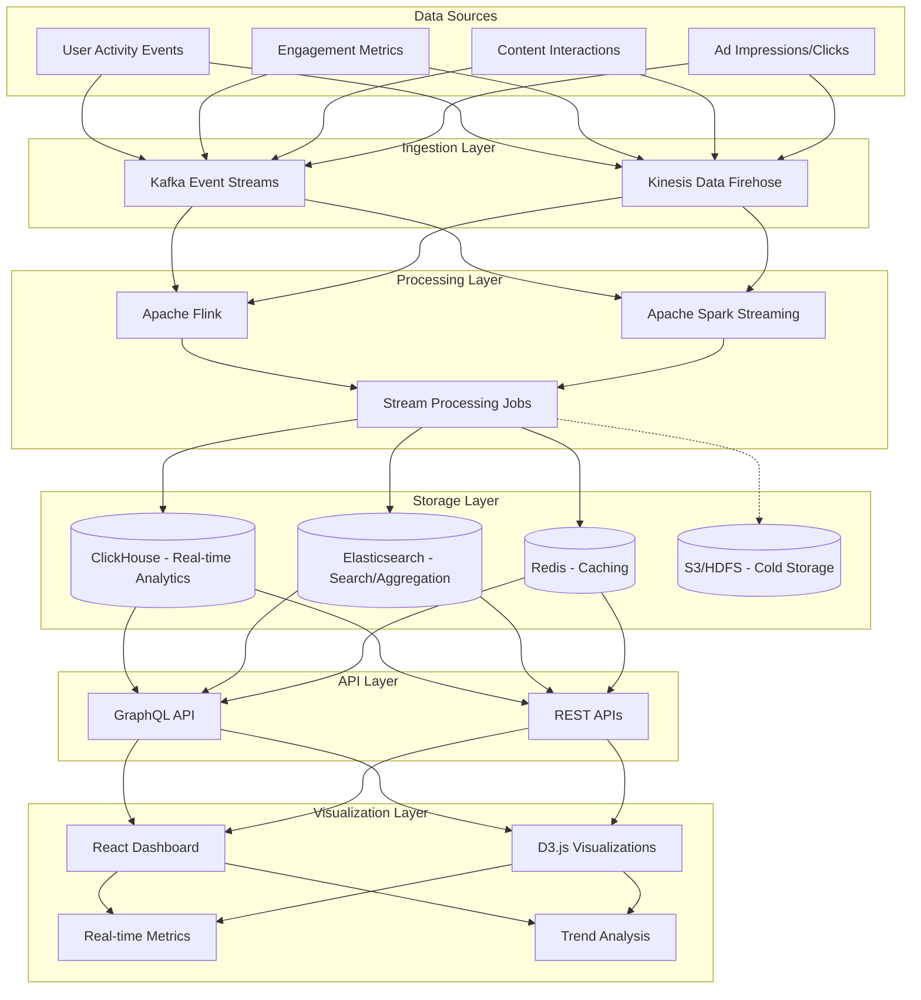

# Real-Time Analytics Dashboard Architecture

## Overview
This architecture transforms the current T-1 (nightly) processing into a near real-time analytics system, enabling immediate insights for decision-making.

## Architecture Diagram

## Components Description

### Data Sources
- **User Activity Events**: Logins, page views, feature usage
- **Engagement Metrics**: Likes, shares, comments, time spent
- **Content Interactions**: Post creation, media uploads
- **Ad Impressions/Clicks**: Advertising performance data

### Ingestion Layer
- **Kafka Event Streams**: Distributed event streaming platform handling millions of events per second
- **Kinesis Data Firehose**: Alternative for AWS environments, manages data delivery to processing systems

### Processing Layer
- **Apache Flink**: Stateful computations over unbounded streams with exactly-once processing semantics
- **Apache Spark Streaming**: Micro-batch processing for complex analytics workloads
- **Stream Processing Jobs**: Custom aggregations, transformations, and enrichment

### Storage Layer
- **ClickHouse**: Column-oriented DBMS optimized for real-time analytics queries
- **Elasticsearch**: Fast search and complex aggregations for trending topics
- **Redis**: In-memory data structure store for caching and leaderboards
- **S3/HDFS**: Long-term storage for historical analysis and compliance

### API Layer
- **GraphQL API**: Flexible query interface for dashboard components
- **REST APIs**: Standard interfaces for system integration

### Visualization Layer
- **React Dashboard**: Component-based UI with modular analytics widgets
- **D3.js Visualizations**: Custom interactive charts and graphs
- **Real-time Metrics**: Live counters, gauges, and KPIs
- **Trend Analysis**: Pattern detection and anomaly highlighting

## Implementation Considerations

1. **Scalability**: Horizontally scalable components to handle social network scale
2. **Latency**: End-to-end processing under 5 seconds for critical metrics
3. **Reliability**: Fault-tolerant architecture with no single point of failure
4. **Data Consistency**: Exactly-once processing guarantees to prevent duplicate/missing analytics
5. **Backpressure Handling**: Rate limiting and buffering strategies for traffic spikes

